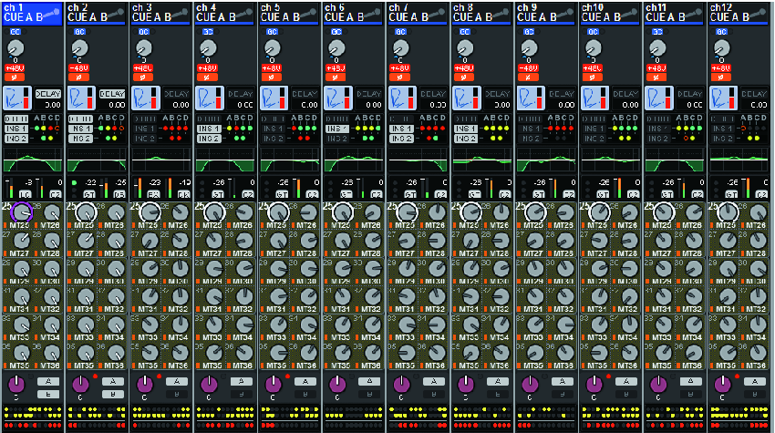

# Yamaha RIVAGE PM: 12-channel Overview

[Reference index](../README.md) · [Offline gallery](../index.html)

- Source: [Yamaha RIVAGE PM manufacturer material](https://manual.yamaha.com/pa/mixers/RIVAGE_PM_series/en-US/7391328779.html)
- Asset: [original image or manual](https://manual.yamaha.com/pa/mixers/RIVAGE_PM_series/Images/png/5328481291__Web.png)
- Version/context: Online manual, published 01/2026; screen firmware not identified
- Locator: Complete source image
- Stored dimensions: 850 × 475 px
- Acquisition and visual inspection: 2026-10-06
- Processing: Unmodified manufacturer PNG
- SHA-256: `bf320cd0a2f7c297c1b9a43e11184103af6cfce6705dad743391b17aa1890b82`
- Rights: third-party manufacturer reference; no open redistribution licence established. See [source register](../SOURCES.md).

## Screen purpose

Orient across a bank of twelve audio channels without opening twelve separate editors. This is a processing overview rather than a large-fader mixing page.

## Visible layout

Twelve equal-width vertical strips fill the frame. Each starts with channel number, name and icon, then preamp controls, red switch indicators, a small processing display and insert-status dots. Tiny EQ curves and dynamics/meter areas sit above a large repeated block of send knobs. Pan and assignment controls occupy the lower strip; rows of coloured indicators finish the bottom. Channel 1 has a bright blue identity header.

## Visible controls and data

The send region consumes the largest vertical area and repeats destinations down each strip. The screenshot shows miniature frequency-response shapes, varying meter bars, analogue-style round controls and abbreviated destination labels. Small insert dots encode several independent states in very little space. There is no full-width selected-channel graph here, and exact processing settings cannot all be read at bank distance.

## Visual hierarchy and state markings

Black backgrounds and thin strip separators establish a stable grid. Blue identifies the selected channel; green curves, orange meter segments and red switches add distinct information layers. Repeated knobs look consistent but produce a visually busy field. The name and number remain the most reliable spatial anchors when the small indicators are hard to read.

## Workflow supported by the reference

Use the bank to find a channel and a processing block, then open a larger editor for precision. The manufacturer identifies this as a twelve-channel layer overview; the image itself cannot establish the result of tapping a meter or changing a send.

## Design implications for our desk

Keep twelve stable channel positions as a candidate SHR Desk bank, with selection surviving page changes. Reserve the small-strip area for a few meaningful summaries and show the selected monitor destination explicitly. Move dense sends into a dedicated selected-channel or sends page. Add applied/pending/held state, which this reference does not show.

## Evidence limits

The 850×475 source supports strip structure and broad colour relationships. Many abbreviated labels and numeric values are too small for transcription. Firmware is not identified by the standalone image; do not treat the send count or bank count as our engine capacity.

The observations describe the retained picture. Design implications are proposals, not accepted product requirements or proof of engine capability.
