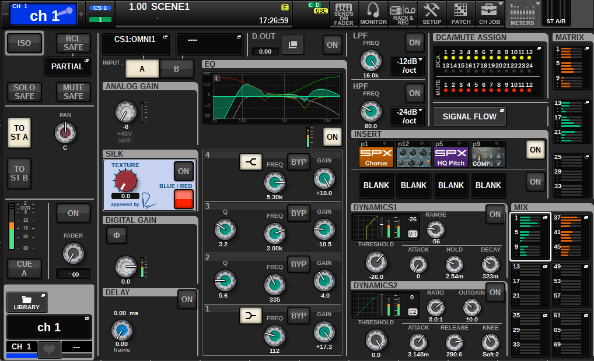

# Yamaha RIVAGE PM: Selected Channel View

[Reference index](../README.md) · [Offline gallery](../index.html)

- Source: [Yamaha RIVAGE PM manufacturer material](https://manual.yamaha.com/pa/mixers/RIVAGE_PM_series/en-US/7391328779.html)
- Asset: [original image or manual](https://manual.yamaha.com/pa/mixers/RIVAGE_PM_series/Images/png/6111843083__Web.png)
- Version/context: Online manual, published 01/2026; screen firmware not identified
- Locator: Complete source image
- Stored dimensions: 1018 × 620 px
- Acquisition and visual inspection: 2026-10-06
- Processing: Unmodified manufacturer PNG
- SHA-256: `f9c21505fe83cbe2068c6434fb46a59f8b7c491fc6afff1c4a55017f6c113d7d`
- Rights: third-party manufacturer reference; no open redistribution licence established. See [source register](../SOURCES.md).

## Screen purpose

Inspect most of one selected audio channel on a single page, while retaining navigation to system operations and bus sends.

## Visible layout

A top bar holds the blue ch 1 identity, scene and time, followed by Sends on Fader, Monitor, Rack & Rec, Setup, Patch, Channel Job and Meters. The left column contains safety/assignment switches, pan, cue/fader and library/name areas. Source, analogue gain, Silk, digital gain and delay occupy the next column. A large EQ response and four band-control rows fill the middle; filters, inserts, DCA/mute assignment, two dynamics blocks and compact matrix/mix sends fill the right.

## Visible controls and data

The EQ places coloured response lines above frequency, Q and gain knobs with nearby band bypasses. The source block distinguishes input A/B from the selected channel. Dynamics blocks combine a small transfer graph, meters and timing/threshold controls. Insert slots show named processors such as Chorus and HQ Pitch, followed by blank slots. Send banks are visibly numbered and use short horizontal level bars.

## Visual hierarchy and state markings

Most controls use dark rectangular groups and metallic knob graphics. Bright blue marks identity, cyan/green indicates processing, and amber or green bars distinguish send blocks. The layout offers many direct targets but demands close viewing. The top identity is considerably stronger than the small individual parameter labels.

## Workflow supported by the reference

This is the detailed counterpart to the bank overview: select the channel, inspect its signal chain, then target a processor or destination. Source selection, channel selection and send destination are visibly different concepts. The screenshot does not prove which edits require an additional popup.

## Design implications for our desk

Borrow the clear source/channel distinction, persistent identity and graph-plus-values arrangement. For SHR Desk, use a smaller number of readable blocks on the Full-HD grid, with the controller legend aligned to actual controls. Treat inserts, dynamics and sends as provider capabilities and show unavailable controls truthfully.

## Evidence limits

The standalone figure is 1018×620. It shows a populated manufacturer example, not a measured signal chain. Its rendered curves and meters provide no calibration or timing evidence for our system.

The observations describe the retained picture. Design implications are proposals, not accepted product requirements or proof of engine capability.
