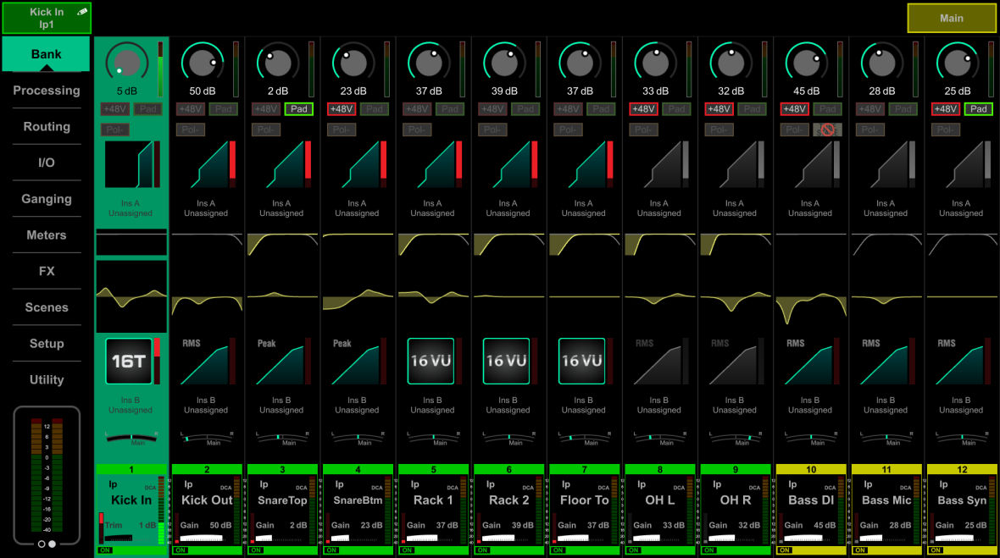

# Allen & Heath Avantis: Input-channel Bank View

[Reference index](../README.md) · [Offline gallery](../index.html)

- Source: [Allen & Heath Avantis manufacturer material](https://www.allen-heath.com/content/uploads/2023/05/Avantis-Firmware-Reference-Guide-V1.20.pdf)
- Asset: [original image or manual](https://www.allen-heath.com/content/uploads/2023/05/Avantis-Firmware-Reference-Guide-V1.20.pdf)
- Version/context: Firmware Reference Guide V1.20
- Locator: PDF page 8 (one-based), embedded figure xref 246
- Stored dimensions: 1180 × 659 px
- Acquisition and visual inspection: 2026-10-06
- Processing: Complete embedded manual figure extracted to PNG; no UI crop or enlargement; RGB conversion where required
- SHA-256: `96863219859f9707a7ea04c556126b80774d0ddc8f45baa7222faba6e880656a`
- Rights: third-party manufacturer reference; no open redistribution licence established. See [source register](../SOURCES.md).

## Screen purpose

Survey an input bank using miniature processing summaries, with a persistent selected channel and active mix context.

## Visible layout

A left navigation rail lists Bank, Processing, Routing, I/O, Ganging, Meters, FX, Scenes, Setup and Utility. Kick In / Ip1 appears above it, and Main appears at the upper right. Twelve strips occupy the remaining width. Kick In is filled turquoise from top to bottom. Each strip stacks preamp gain, phantom/pad/polarity controls, gate/filter/EQ/dynamics summaries, pan and a bottom channel-name card.

## Visible controls and data

Channel labels include Kick Out, SnareTop, SnareBtm, Rack 1, Rack 2, Floor To, OH L/R and bass sources. Several dynamics blocks show 16T or 16VU processor badges, while others show transfer curves and Peak/RMS labels. Tiny red meter strips sit beside processing summaries. The bottom cards repeat channel number, name, gain/trim and an ON indicator. The lower-left meter remains outside the selected strip.

## Visual hierarchy and state markings

Turquoise selection, green channel identity bars and yellow EQ curves make different roles legible. Some inactive-looking processing shapes are grey, while active-looking shapes are coloured; exact meaning should be checked before copying. Full-height selected-strip fill is much easier to locate than a one-pixel focus ring, though it also reduces background contrast for some text.

## Workflow supported by the reference

Find a named source, select it, then enter a processing or routing page using the stable left rail. The image supports a clear overview/detail relationship. Channel selection and mix selection are separately visible, which helps prevent editing a channel under an unnoticed destination context.

## Design implications for our desk

Use stable strip order, an obvious selected strip and explicit source/mix identity in SHR Desk. Keep only readable miniature summaries and open exact values in Channel. Do not make the whole strip an undifferentiated edit target; distinguish focus from intentional application, and provide held/pending status alongside processing state.

## Evidence limits

Extracted complete Bank View figure from manual page 8, V1.20. Text is readable at native 1180×659, but the bottom names illustrate truncation. The twelve-strip example is a screen layout, not a channel-count ceiling.

The observations describe the retained picture. Design implications are proposals, not accepted product requirements or proof of engine capability.
