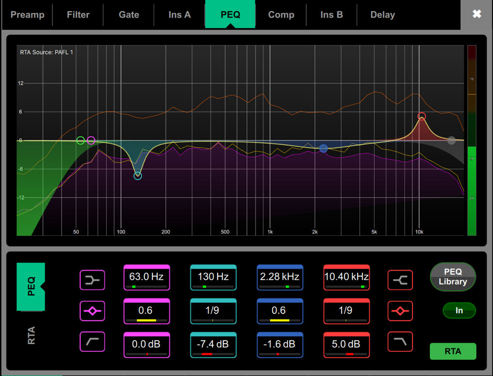

# Allen & Heath Avantis: Four-band parametric EQ

[Reference index](../README.md) · [Offline gallery](../index.html)

- Source: [Allen & Heath Avantis manufacturer material](https://www.allen-heath.com/content/uploads/2023/05/Avantis-Firmware-Reference-Guide-V1.20.pdf)
- Asset: [original image or manual](https://www.allen-heath.com/content/uploads/2023/05/Avantis-Firmware-Reference-Guide-V1.20.pdf)
- Version/context: Firmware Reference Guide V1.20
- Locator: PDF page 13 (one-based), embedded figure xref 298
- Stored dimensions: 1016 × 777 px
- Acquisition and visual inspection: 2026-10-06
- Processing: Complete embedded manual figure extracted to PNG; no UI crop or enlargement; RGB conversion where required
- SHA-256: `0efb7a8b0edede6159ca4a33acdd116fa7e7c077eec0508e888e9b03dffdb401`
- Rights: third-party manufacturer reference; no open redistribution licence established. See [source register](../SOURCES.md).

## Screen purpose

Edit a four-band parametric EQ while comparing its combined response with a labelled analysis overlay.

## Visible layout

Stable processing tabs run across the top: Preamp, Filter, Gate, Ins A, PEQ, Comp, Ins B and Delay; PEQ is turquoise. A large logarithmic frequency graph occupies roughly the upper two-thirds. Below it, four coloured parameter columns align frequency, Q/bandwidth and gain. Shape buttons flank the columns, and PEQ Library, In and RTA controls sit on the right.

## Visible controls and data

Visible band frequencies are 63.0 Hz, 130 Hz, 2.28 kHz and 10.40 kHz. Their displayed gains are 0.0, −7.4, −1.6 and +5.0 dB. The graph shows coloured circular handles, the combined curve and additional orange/purple traces. RTA Source: PAFL 1 is written inside the graph. A vertical level scale/meter occupies the right edge. The lower controls offer precise values as an alternative to dragging handles.

## Visual hierarchy and state markings

Magenta, cyan, blue and red persist from graph handles to parameter boxes. A yellow combined response and shaded filter areas remain visible against a dark grid. This is useful categorical colour, but several overlapping traces can compete for attention; a legend and explicit overlay toggles would improve interpretation.

## Workflow supported by the reference

Choose the relevant processing tab and band, inspect its exact values, then adjust by graph or numeric control. The figure keeps processing enable and analysis controls separate. It does not show draft/review/confirm state or the effect of a bypass action.

## Design implications for our desk

This is a strong reference for SHR Desk Channel EQ: coloured band identity, exact Hz/dB/Q values, bypass state and a large response curve. Use only supported filter types and provider-reported values. Identify the analysis tap, freshness and calibration, and make measured spectrum visually distinct from the computed EQ response.

## Evidence limits

Manual V1.20, page 13; extracted 1016×777 figure. The screenshot is illustrative analysis, not real acoustic evidence. Do not infer PAFL 1 is the same signal as the selected channel, or invent an RTA feed when the provider does not expose one.

The observations describe the retained picture. Design implications are proposals, not accepted product requirements or proof of engine capability.
