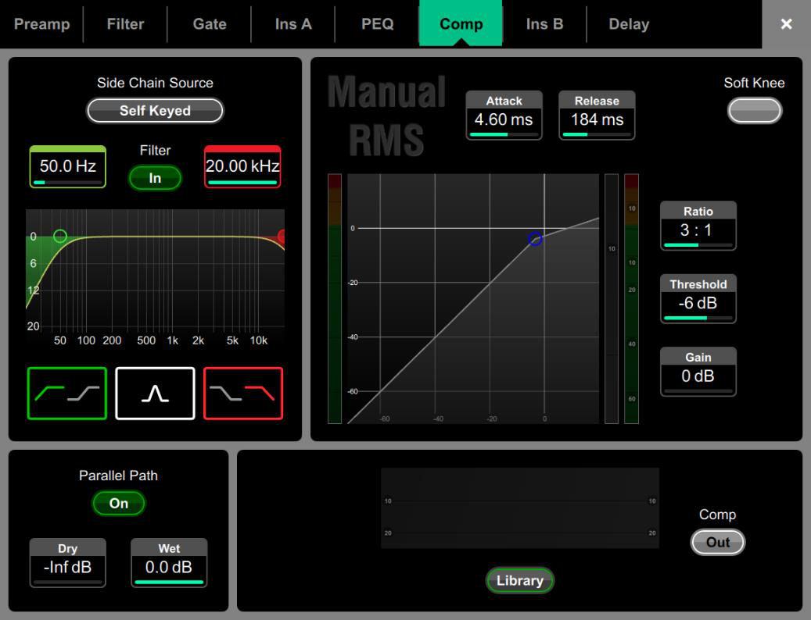

# Allen & Heath Avantis: Compressor and sidechain

[Reference index](../README.md) · [Offline gallery](../index.html)

- Source: [Allen & Heath Avantis manufacturer material](https://www.allen-heath.com/content/uploads/2023/05/Avantis-Firmware-Reference-Guide-V1.20.pdf)
- Asset: [original image or manual](https://www.allen-heath.com/content/uploads/2023/05/Avantis-Firmware-Reference-Guide-V1.20.pdf)
- Version/context: Firmware Reference Guide V1.20
- Locator: PDF page 15 (one-based), embedded figure xref 320
- Stored dimensions: 1037 × 794 px
- Acquisition and visual inspection: 2026-10-06
- Processing: Complete embedded manual figure extracted to PNG; no UI crop or enlargement; RGB conversion where required
- SHA-256: `1c27aa586874197bd42a6f03c87ea7bc38be78add17111f57080d67e70967aa0`
- Rights: third-party manufacturer reference; no open redistribution licence established. See [source register](../SOURCES.md).

## Screen purpose

Present a compressor as a complete processing block, including its trigger source, timing, transfer curve and parallel-path controls.

## Visible layout

The same processing tab row remains across the top, with Comp selected. A left panel holds Side Chain Source, high/low filter values, a frequency graph and filter-mode icons. A larger right panel shows Manual RMS, attack and release boxes, soft-knee control, a transfer curve with flanking meters and ratio/threshold/gain values. Parallel Path occupies the lower left; a dark secondary graph/library area and Comp Out control fill the lower right.

## Visible controls and data

The visible example is self-keyed, with filter endpoints 50.0 Hz and 20.00 kHz. Attack is 4.60 ms, release 184 ms, ratio 3:1, threshold −6 dB and gain 0 dB. Parallel Path is On, with Dry −Inf dB and Wet 0.0 dB. Comp is shown Out. Those independent labels demonstrate why configured parameters must not be mistaken for an enabled processor.

## Visual hierarchy and state markings

Dark subpanels and wide grey separators group functions before colour is applied. Green traces/enable controls and small cyan value bars contrast with white labels. Large Manual RMS text signals the processor model; ratio and threshold remain high-priority readable numbers next to the transfer curve.

## Workflow supported by the reference

Identify the compressor model and sidechain, set time/transfer parameters, then deliberately enable or bypass processing. The page supports inspecting configuration while the compressor is out. Meter semantics are not fully established by the image alone.

## Design implications for our desk

For SHR Desk, keep threshold, ratio, attack, release, makeup gain and bypass together. Label any gain-reduction meter explicitly and use provider telemetry. Preserve configured versus enabled versus applied distinctions; omit sidechain/parallel-path widgets until those capabilities exist. The graph should aid editing without hiding exact values or command review.

## Evidence limits

Manual V1.20, page 15; complete 1037×794 embedded figure. No compression sound, detector behaviour or live gain-reduction performance was tested. The example model is not a specification for GigPies DSP.

The observations describe the retained picture. Design implications are proposals, not accepted product requirements or proof of engine capability.
