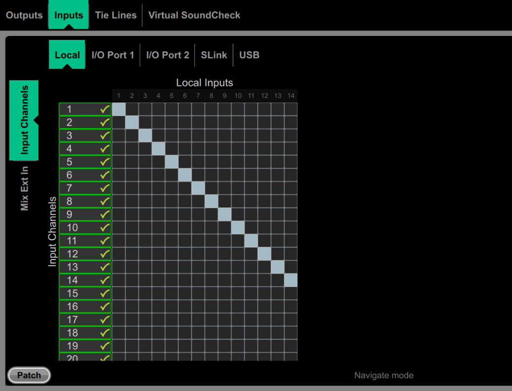

# Allen & Heath Avantis: Local input patch matrix

[Reference index](../README.md) · [Offline gallery](../index.html)

- Source: [Allen & Heath Avantis manufacturer material](https://www.allen-heath.com/content/uploads/2023/05/Avantis-Firmware-Reference-Guide-V1.20.pdf)
- Asset: [original image or manual](https://www.allen-heath.com/content/uploads/2023/05/Avantis-Firmware-Reference-Guide-V1.20.pdf)
- Version/context: Firmware Reference Guide V1.20
- Locator: PDF page 22 (one-based), embedded figure xref 398
- Stored dimensions: 1037 × 794 px
- Acquisition and visual inspection: 2026-10-06
- Processing: Complete embedded manual figure extracted to PNG; no UI crop or enlargement; RGB conversion where required
- SHA-256: `3881c2817a1be71ce050f7b55c6f2e294560a619d296ed8b1920cd2fa73d48ee`
- Rights: third-party manufacturer reference; no open redistribution licence established. See [source register](../SOURCES.md).

## Screen purpose

Show physical input-to-logical-channel assignments in a matrix while separating browsing from an explicit patch operation.

## Visible layout

The upper navigation has Outputs, Inputs, Tie Lines and Virtual SoundCheck, with Inputs selected. A second row selects Local, I/O Port 1, I/O Port 2, SLink or USB. The left axis is labelled Input Channels, with a separate Mix Ext In selector. The horizontal axis is Local Inputs. A square-cell matrix occupies the left/middle; substantial blank space remains on the right. Patch is at bottom left and Navigate mode is labelled along the bottom.

## Visible controls and data

Logical channels run vertically and local socket numbers horizontally. A pale diagonal maps the first fourteen visible local inputs one-to-one. Green checkmarks appear beside channel row labels, including rows without a visible filled cell in this cropped matrix extent. The lower rows and further columns are not all visible. This prevents treating the shown portion as the entire patch.

## Visual hierarchy and state markings

Turquoise tabs and axis panels distinguish navigation context from pale filled assignment cells. Thin grey cell borders make sparse assignments easy to trace. Numeric axes remain fixed at the top and left. Because both axes use plain numbers, their explicit source/channel labels do important safety work.

## Workflow supported by the reference

Select a source domain and logical destination family, inspect the matrix in Navigate mode, then use the patch action. The image does not establish whether a second confirmation exists or how conflicting assignments are resolved.

## Design implications for our desk

Use this for SHR Desk routing discussions: keep logical channel IDs distinct from physical socket and USB identities, display the exact source/destination on focus, and review changes before submission. Provide a readable list alternative for keyboard/controller use. Dynamic capacity should come from the provider, with missing ports shown explicitly.

## Evidence limits

Manual V1.20, page 22; complete 1037×794 figure. Green checks are visible marks, not proof of clock lock or connected hardware. The screenshot cannot establish the current physical patch or our provider routing semantics.

The observations describe the retained picture. Design implications are proposals, not accepted product requirements or proof of engine capability.
