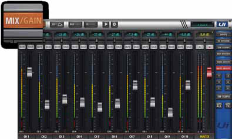

# Soundcraft Ui24R: Tablet Mix page

[Reference index](../README.md) · [Offline gallery](../index.html)

- Source: [Soundcraft Ui24R manufacturer material](https://www.harmanaudio.com/on/demandware.static/-/Sites-masterCatalog_Harman/default/dwce13b735/pdfs/Soundcraft_ui24r_Manual_V1.0_Web.pdf)
- Asset: [original image or manual](https://www.harmanaudio.com/on/demandware.static/-/Sites-masterCatalog_Harman/default/dwce13b735/pdfs/Soundcraft_ui24r_Manual_V1.0_Web.pdf)
- Version/context: User Guide v1.0
- Locator: PDF page 40 (one-based), embedded figure xref 436
- Stored dimensions: 395 × 237 px
- Acquisition and visual inspection: 2026-10-06
- Processing: Complete embedded manual figure extracted to PNG; no UI crop or enlargement; RGB conversion where required
- SHA-256: `b5f83fc3c60b4bd8ae41b76b3cd0f168aad9b9872e4dfb25e7e7df2b7f5aa2c7`
- Rights: third-party manufacturer reference; no open redistribution licence established. See [source register](../SOURCES.md).

## Screen purpose

Compare a compact browser/tablet mixer with the denser large-console bank views.

## Visible layout

A horizontal mixer bank spans almost the entire frame, with narrow strips, long vertical fader tracks and meters. Navigation is above the strips and a narrow control/menu area is on the right. Channel names/numbers sit at the bottom. A yellow-framed MASTER strip remains on the right edge of the bank. A manufacturer teaching callout enlarges the MIX/GAIN button at the upper left.

## Visible controls and data

Fader caps sit at different heights, with narrow green/yellow/red meter bars alongside them. Short top-row buttons repeat across strips. The bottom sequence shows channel labels followed by MASTER, giving a spatial reference even at low resolution. The MIX/GAIN enlargement is an annotation on the illustration, not a floating software widget. Exact values are too small to transcribe reliably.

## Visual hierarchy and state markings

The interface uses dark strips, pale fader caps, small orange/red navigation accents and a stronger yellow master border. It relies on repeated vertical geometry more than large labels. The teaching callout interrupts the native view, but it usefully reveals an otherwise tiny mode control.

## Workflow supported by the reference

The manual presents this as the tablet Mix screen. It supports the familiar bank-and-master mental model; detailed operation and selected-channel transitions require the surrounding manual rather than this tiny figure alone.

## Design implications for our desk

Borrow the unmistakable long fader tracks and persistent master reference, but enlarge labels and destination context for SHR Desk. A Full-HD desktop need not inherit cramped tablet button sizes. Keep the actual main output and human ownership visible; preserve bank position when entering Channel or a monitor-send view.

## Evidence limits

User Guide v1.0, PDF page 40, embedded 395×237 annotated figure. This is intentionally retained as a low-resolution layout reference. Upscaling would not recover text, and the visible meter activity proves nothing about our processing.

The observations describe the retained picture. Design implications are proposals, not accepted product requirements or proof of engine capability.
