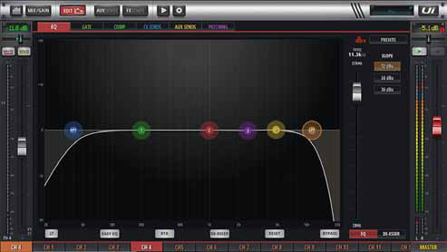

# Soundcraft Ui24R: Parametric EQ page

[Reference index](../README.md) · [Offline gallery](../index.html)

- Source: [Soundcraft Ui24R manufacturer material](https://www.harmanaudio.com/on/demandware.static/-/Sites-masterCatalog_Harman/default/dwce13b735/pdfs/Soundcraft_ui24r_Manual_V1.0_Web.pdf)
- Asset: [original image or manual](https://www.harmanaudio.com/on/demandware.static/-/Sites-masterCatalog_Harman/default/dwce13b735/pdfs/Soundcraft_ui24r_Manual_V1.0_Web.pdf)
- Version/context: User Guide v1.0
- Locator: PDF page 70 (one-based), embedded figure xref 956
- Stored dimensions: 493 × 278 px
- Acquisition and visual inspection: 2026-10-06
- Processing: Complete embedded manual figure extracted to PNG; no UI crop or enlargement; RGB conversion where required
- SHA-256: `4de5599fca396da4300954623821b7eb0e55f758154adb7eb1d31dc0c37e64f3`
- Rights: third-party manufacturer reference; no open redistribution licence established. See [source register](../SOURCES.md).

## Screen purpose

Show how a smaller mixer keeps the selected-channel fader and master context while a large EQ graph is open.

## Visible layout

A broad frequency-response graph occupies the centre. The selected channel strip stays on the left and MASTER stays on the right, with navigation above and a channel-selection row below. Coloured graph handles span low cut, midrange bands and high cut. A narrow parameter/control column appears to the right of the graph.

## Visible controls and data

The white response is mostly flat through the middle, rolling off sharply at both ends. Six visible coloured handles distinguish different filter controls. The left fader and right master meters remain present while editing EQ, and the bottom channel tabs retain orientation. Several exact numeric fields are visible but too soft at this resolution to quote confidently.

## Visual hierarchy and state markings

A very dark background supports the white combined curve and coloured handles. Small matching colour marks at the bottom associate graph controls with editing areas. The graph is visually much stronger than its exact values, illustrating a risk when a design prioritizes dragging over readable numeric editing.

## Workflow supported by the reference

The manual identifies this as the parametric EQ page. It provides a compact detail view with mixer context preserved. The figure alone does not establish keyboard access, gesture behaviour or whether a graph drag affects output immediately.

## Design implications for our desk

SHR Desk can preserve selected identity and main/mix context alongside an EQ detail page. Keep precise Hz/dB/Q values larger than this example and offer a complete keyboard/controller path. A selected graph handle must identify the parameter and supported range. Never substitute an illustrative response for provider-confirmed state.

## Evidence limits

User Guide v1.0, PDF page 70; embedded figure 493×278. It is sufficient for graph-versus-strip allocation, not fine typography or parameter transcription. Four EQ bands and additional cut filters do not imply identical GigPies processing support.

The observations describe the retained picture. Design implications are proposals, not accepted product requirements or proof of engine capability.
