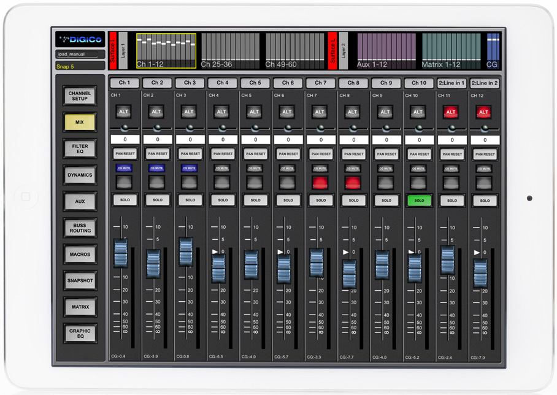

# DiGiCo Quantum 338: iPad control Mix view

[Reference index](../README.md) · [Offline gallery](../index.html)

- Source: [DiGiCo Quantum 338 manufacturer material](https://digico.biz/wp-content/uploads/2020/03/Quantum-338-Brochure.pdf)
- Asset: [original image or manual](https://digico.biz/wp-content/uploads/2020/03/Quantum-338-Brochure.pdf)
- Version/context: Quantum 338 brochure; screenshot build/firmware not established
- Locator: PDF page 5 (one-based), embedded figure xref 212
- Stored dimensions: 908 × 644 px
- Acquisition and visual inspection: 2026-10-06
- Processing: Complete embedded manual figure extracted to PNG; no UI crop or enlargement; RGB conversion where required
- SHA-256: `728625686a8f5b273ce9913a1d7644d624dc09e0bf4d248cd99c1ff4fed2cd71`
- Rights: third-party manufacturer reference; no open redistribution licence established. See [source register](../SOURCES.md).

## Screen purpose

Compare a remote-control mixer page that devotes most of its area to large, direct fader controls.

## Visible layout

The screenshot includes a white tablet bezel. A top miniature bank/layer map groups channels, auxes, matrix and control groups. A vertical left rail offers Channel Setup, Mix, Filter EQ, Dynamics, Aux, Buss Routing, Macros, Snapshot, Matrix and Graphic EQ. Twelve strips fill the main area, with channel labels, pan, mute/solo and long vertical faders.

## Visible controls and data

Each strip has an ALT button, pan control/readout, PAN RESET, mute-related controls, SOLO and a numbered fader scale. Ch 7 and Ch 8 show red mute buttons; Ch 10 has a green SOLO button. Red ALT buttons appear on the rightmost strips. Blue fader caps sit at different positions, with numerical gain readouts along the bottom. MIX is selected in the left rail.

## Visual hierarchy and state markings

Raised pale-grey button graphics and blue faders contrast with a dark strip background. Red/green buttons are stronger than most text. The coloured bank miniature gives an overview separate from the detailed faders. The tablet frame is photographic context rather than usable UI area.

## Workflow supported by the reference

Choose a bank and Mix view, identify a strip, then operate its level/pan/mute/solo controls. The brochure presents this as iPad control; it is not a photograph of the Quantum hardware touchscreens. The visible SOLO button does not establish solo-in-place behaviour.

## Design implications for our desk

Use the hierarchy of bank map, stable strip IDs and large fader targets. SHR Desk needs explicit bank/destination and actual value/owner/pending state because the MiniLab has no motorized faders. Keep reset actions deliberate and distinguish monitor audition from audience-mix mute. A remote-control layout is inspiration, not a dependency on a web/tablet frontend.

## Evidence limits

Quantum 338 brochure, PDF leaf 5 / printed spread 8–9; complete embedded 908×644 figure with bezel. The brochure labels iPad control as forthcoming, so this is a promotional interface illustration rather than demonstrated availability or live connection evidence.

The observations describe the retained picture. Design implications are proposals, not accepted product requirements or proof of engine capability.
