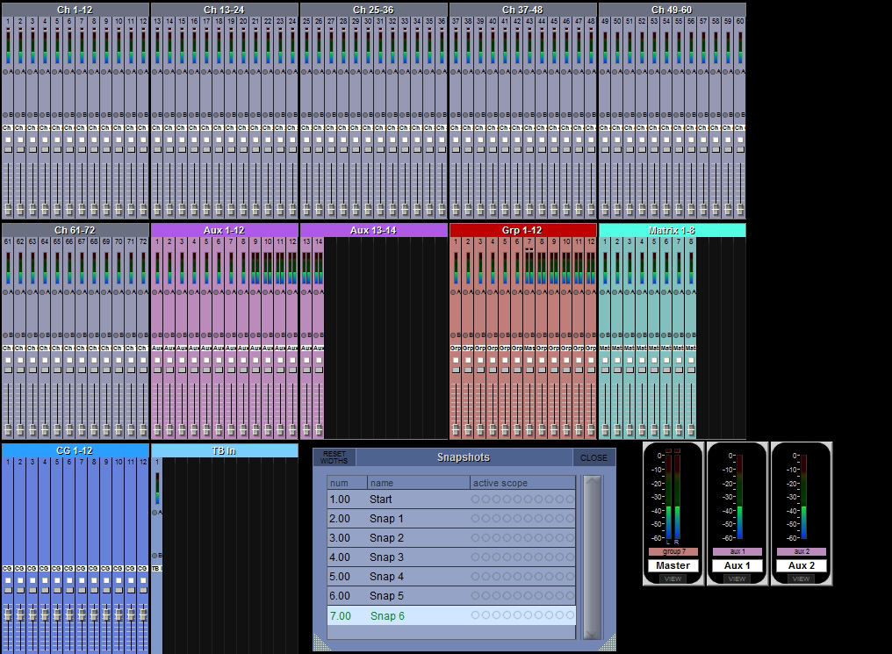

# DiGiCo Quantum 338: System overview and snapshots

[Reference index](../README.md) · [Offline gallery](../index.html)

- Source: [DiGiCo Quantum 338 manufacturer material](https://digico.biz/wp-content/uploads/2020/03/Quantum-338-Brochure.pdf)
- Asset: [original image or manual](https://digico.biz/wp-content/uploads/2020/03/Quantum-338-Brochure.pdf)
- Version/context: Quantum 338 brochure; screenshot build/firmware not established
- Locator: PDF page 5 (one-based), embedded figure xref 213
- Stored dimensions: 1016 × 745 px
- Acquisition and visual inspection: 2026-10-06
- Processing: Complete embedded manual figure extracted to PNG; no UI crop or enlargement; RGB conversion where required
- SHA-256: `8a71bce84c739eef7b424b13a43fc83b9d19c7b3c645b35623e22510cc4b50e4`
- Rights: third-party manufacturer reference; no open redistribution licence established. See [source register](../SOURCES.md).

## Screen purpose

Survey a large console across multiple channel and bus families while keeping snapshot information in the same workspace.

## Visible layout

The top row contains five groups of twelve narrow input strips, labelled Ch 1–12 through Ch 49–60. A second row contains Ch 61–72, Aux 1–12, Aux 13–14, Grp 1–12 and Matrix 1–8. A bottom row contains CG 1–12, TB In, a Snapshots window and three larger Master/Aux meter tiles.

## Visible controls and data

Every miniature strip repeats a number, meter, small controls and fader. Inputs use grey-purple panels; aux, group, matrix and control-group regions use distinct tinted backgrounds. The Snapshots table shows Start and Snap 1–6, with Snap 6 highlighted in pale blue and green text. The meter tiles are labelled Master, Aux 1 and Aux 2 and each has a VIEW button.

## Visual hierarchy and state markings

Spatial grouping and background colours make a high channel count scannable before names can be read. Dense repetition is powerful for overview but poor for exact editing. The snapshot panel is much larger per item than the miniature input strips, revealing a tradeoff between signal survey and scene control.

## Workflow supported by the reference

Locate a channel or bus family from the global overview, then open its larger control view. The snapshot list is visible alongside signal status. The image does not prove that the highlighted snapshot is loaded or that selecting its row recalls it.

## Design implications for our desk

Use a global channel/bus map as an optional SHR Desk orientation view, with explicit channel count and bank navigation. Keep scene selection separate from a reviewed recall. Avoid compressing the entire dynamic mixer into unreadable strips; the normal twelve-strip bank should remain the working view. Show role, freshness and unavailable telemetry.

## Evidence limits

Quantum 338 brochure, PDF leaf 5 / printed spread 8–9; 1016×745 embedded figure. Exact names and tiny status indicators are often unreadable. Shown capacities belong to the example console, not our target or accepted provider schema.

The observations describe the retained picture. Design implications are proposals, not accepted product requirements or proof of engine capability.
