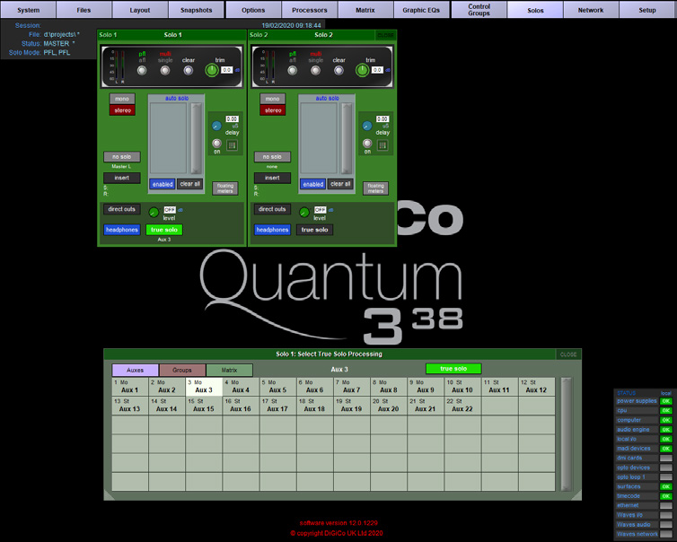

# DiGiCo Quantum 338: Solo buses and True Solo source selection

[Reference index](../README.md) · [Offline gallery](../index.html)

- Source: [DiGiCo Quantum 338 manufacturer material](https://digico.biz/wp-content/uploads/2020/03/Quantum-338-Brochure.pdf)
- Asset: [original image or manual](https://digico.biz/wp-content/uploads/2020/03/Quantum-338-Brochure.pdf)
- Version/context: Quantum 338 brochure; screenshot build/firmware not established
- Locator: PDF page 3 (one-based), embedded figure xref 21
- Stored dimensions: 754 × 604 px
- Acquisition and visual inspection: 2026-10-06
- Processing: Complete embedded manual figure extracted to PNG; no UI crop or enlargement; RGB conversion where required
- SHA-256: `6b1ab3bf0354d77e827b468c51d102d2a89d016825f46f55a35033023f54b7b0`
- Rights: third-party manufacturer reference; no open redistribution licence established. See [source register](../SOURCES.md).

## Screen purpose

Inspect dedicated solo-bus controls and select a processing source without hiding the fact that audition routing has its own context.

## Visible layout

A global menu runs across the top: System, Files, Layout, Snapshots, Options, Processors, Matrix, Graphic EQs, Control Groups, Solos, Network and Setup. Two green-framed Solo 1 and Solo 2 windows occupy the upper-left half. A lower popup titled Solo 1: Select True Solo Processing contains Auxes, Groups and Matrix tabs and a numbered source grid. A compact system-status list sits at lower right.

## Visible controls and data

The solo windows show trim, mono/stereo, auto-solo, delay, enabled/clear-all and headphone/direct-output areas. The source popup has Aux 3 in its header and a green true solo button; Auxes is selected and many Aux entries are visible. The unused central area shows the Quantum 338 logo. These multiple floating panels illustrate explicit context, but also create substantial empty/background space.

## Visual hierarchy and state markings

Green is used heavily for solo panels and active choices, pale lavender for top menus and tab labels, and black for the workspace. Selected/inactive controls vary in colour and button relief. The logo is decorative and contributes no operational information; our own reference should focus on panel relationships.

## Workflow supported by the reference

Enter solo configuration, inspect the bus, and choose the intended processing source from a named popup. The brochure associates this with True Solo, but the screenshot cannot establish audition DSP semantics, latency or whether the source reaches headphones.

## Design implications for our desk

For SHR Desk, explicitly separate PFL/AFL or monitor audition from audience-path controls, and display destination/source before a routing change. Prefer a bounded side inspector or deliberate modal to overlapping panels on one display. Keep unsupported audition features unavailable and avoid inferring ownership from colour alone.

## Evidence limits

Quantum 338 brochure, PDF leaf 3 / printed spread 4–5; complete 754×604 figure. Small captions are soft. No DiGiCo console or headphone path was operated; True Solo is reference-console functionality, not an implemented GigPies feature.

The observations describe the retained picture. Design implications are proposals, not accepted product requirements or proof of engine capability.
