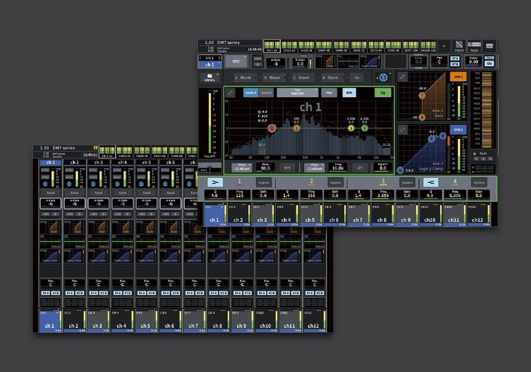

# Yamaha DM7: Overview and Selected Channel comparison

[Reference index](../README.md) · [Offline gallery](../index.html)

- Source: [Yamaha DM7 manufacturer material](https://usa.yamaha.com/products/proaudio/mixers/dm7/features.html)
- Asset: [original image or manual](https://usa.yamaha.com/files/DM7-image-Selected-Channel-View-and-Overview_3cdbfc5b16568a7e460e8622990e99fb.jpg)
- Version/context: Unversioned manufacturer feature page; promotional composite
- Locator: Complete source image
- Stored dimensions: 770 × 540 px
- Acquisition and visual inspection: 2026-10-06
- Processing: Manufacturer JPEG converted losslessly to PNG; full frame preserved
- SHA-256: `0c67bfadc0fb3326295462f54e139533d7eb35b9ec434e2a100748c2f389b611`
- Rights: third-party manufacturer reference; no open redistribution licence established. See [source register](../SOURCES.md).

## Screen purpose

Compare the overview/detail relationship in a newer Yamaha visual language within one manufacturer promotional composite.

## Visible layout

Two overlapping screen illustrations sit on a grey background. The lower-left view is a twelve-strip overview, with processing summaries above pan, assignment and channel labels. The larger upper-right view has a persistent top meter/navigation row, a channel EQ graph and band values, dynamics blocks on the right, and a twelve-channel selector along its bottom.

## Visible controls and data

The upper view labels channel 1 and shows EQ nodes and dynamics curves alongside meter columns. A horizontal band editor below the graph exposes frequency, gain and Q in repeated groups. The lower overview uses compact EQ/dynamics thumbnails and abbreviated strip labels. These are two alternative views of the same channel context, not simultaneous windows captured on an operated console.

## Visual hierarchy and state markings

Flat dark panels, thin borders and strong blue selected-channel areas replace some of the older RIVAGE image’s heavy knob graphics. Processing blocks use orange, blue and green accents. The grey canvas and overlapping arrangement are marketing composition; neither should be mistaken for the actual desktop layout.

## Workflow supported by the reference

The official feature page presents an Overview and a Selected Channel View. The images support a clear path from bank orientation to detailed editing. They do not show every intermediate popup, input method, review state or command acknowledgement.

## Design implications for our desk

Compare this with the RIVAGE pair when deciding how much detail belongs in the normal bank. SHR Desk can keep a stable bank and offer a large selected EQ/dynamics editor, with readable identity and current bus. Retain our pixel-aligned font/controller legend rather than imitating Yamaha artwork, and add engine authority/freshness.

## Evidence limits

Full manufacturer JPEG converted to PNG at 770×540, without cropping. This composite is small and some numeric fields are unreadable. No firmware number is visible; the feature page is unversioned, and no touchscreen was operated.

The observations describe the retained picture. Design implications are proposals, not accepted product requirements or proof of engine capability.
